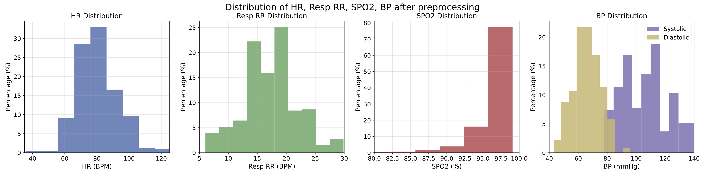

<div align="center">
  
</div>

# 💍 RingTool
RingTool is an open platform for health sensing and data analysis with smart rings. It processes raw **PPG** and **IMU** signals from ring sensors to estimate cardiovascular parameters (HR, RR, SpO2, BP). It offers configurable modules for data preprocessing, physics-based algorithms, supervised learning models (**ResNet**, **InceptionTime**, **Transformer**, **Mamba**), and systematic evaluation. The platform is designed to be flexible and extensible, allowing the community to build custom solutions for a wide range of health and wellness applications.


## 🗃️ Dataset
> The complete dataset will be released upon acceptance of our paper.

### Visualization
Visualization of the ring signal and corresponding medical ground truth. Below is an example of the reflective ring (Ring 1)'s visualizations of the raw data for different activities. For more samples, please refer to the [visualizations](visualizations) folder.


### Data Collection
Our data was collected from two certain protocols.

> **Stimulus-evoked data collection procedure across physiological states.** The protocol consists of three main activities: (1) A 10-minute seated resting, (2) A 9-minute supervised low-oxygen simulation, and (3) Two 2-minute sessions of deep squat exercises. Blood pressure measurements were taken before and after each activity, while physiological data was continuously recorded by our custom rings and periodically measured by commercial rings for comparison.


> **Data collection procedure across daily activities.** The protocol consists of five activity segments: (1) A 30-minute seated resting, (2) 5-minute sitting and talking, (3) 5-minute head movement, (4) 5-minute standing, and (5) 5-minute walking in place. Participants wore the oximeter, Ring 1 (reflective), Ring 2 (transmissive), and respiratory band throughout all activities.


### Dataset Statistics
Activity and reference label details in $\tau$-Ring dataset.
| Activity               | Description                                                                       | Duration (hrs) |
|------------------------|-----------------------------------------------------------------------------------|----------------|
| All                    | Collective data from all activities listed below                                  | 28.21          |
| Sitting                | Participant in stationary seated position                                         | 11.39          |
| Talking                | Counting from one to one hundred repeatedly                                       | 0.93           |
| Shaking Head           | Head rotation in various directions                                               | 0.94           |
| Standing               | Participant in stationary standing position                                       | 0.93           |
| Walking                | Walking in place with natural arm swinging                                        | 0.91           |
| Low Oxygen Simulation  | Wearing mask with low-oxygen gas to simulate hypoxemia                            | 4.08           |
| Deep Squat             | Full range of motion squat exercise                                               | 1.61           |
| Others                 | User study preparation, device synchronization, blood pressure measurement and other situations not recorded with rings | 9.26           |


| Label   | Description                           | Mean&plusmn;STD        | Range (Min, Max)      | Count   |
|---------|---------------------------------------|----------------------|-----------------------|---------|
| BVP     | Blood Volume Pulse signal samples     | -                    | -                     | 1664446 |
| Resp    | Respiratory waveform samples          | -                    | -                     | 3953694 |
| HR      | Heart Rate measurements               | 80.24&plusmn;12.39 BPM | (26.03, 125.93) BPM   | 76586   |
| RR      | Respiratory Rate calculated from Resp | 17.28&plusmn;4.55 BPM  | (6.04, 29.86) BPM     | 4205    |
| SpO2    | Blood Oxygen Saturation measurements  | 96.33&plusmn;2.46 %   | (78.97, 99.00) %      | 76575   |
| SBP     | Systolic Blood Pressure measurements  | 106.85&plusmn;16.29 mmHg| (78.00, 142.00) mmHg  | 112     |
| DBP     | Diastolic Blood Pressure measurements | 65.85&plusmn;9.41 mmHg | (43.00, 96.00) mmHg   | 112     |
| Samsung | Samsung Galaxy Ring HR measurements   | 92.59&plusmn;23.61 BPM | (50.00, 153.00) BPM   | 128     |
| Oura    | Oura Gen 3 Ring HR measurements       | 89.67&plusmn;22.32 BPM | (36.00, 155.00) BPM   | 118     |


Medical Ground Distribution of HR, RR, SpO2, and BP



### Prepare Your Own Data
You can follow our data collection protocol to build your own ring-based dataset. To ensure compatibility with our pipeline, your dataset should follow the same format --- a directory containing  `.pkl` files organized as shown below:

``` 
rings/
  └── subject_ringtype.pkl
      ├── id, start, end, fs
      ├── ir, red, ax, ay, az, bvp, resp (np.array)
      ├── hr, resp_rr, spo2, samsung_hr, oura_hr, BP_sys, BP_dia (numeric)
      ├── Experiment, Label (string)
```
Each `.pkl` file contains multi-modal physiological data collected from smart rings. Sensor signals (ir, red, ax, ay, az, bvp, resp) are stored as np.array, while other entries (e.g., hr, spo2, BP_sys, Label) are scalar values or strings. Data is synchronized and annotated with timestamps.


## 📊 Benchmark
For each parameter, we compare both physics-based and supervised learning approaches, examining the performance differences between reflective (Ring 1) and transmissive (Ring 2) sensing modalities across various user activities and physiological states. The best results for each task are summarized in the below table.

| Task | Method / Ring | MAE | RMSE | MAPE | Pearson | Method / Ring | MAE | RMSE | MAPE | Pearson |
|------|---------------|------------|-------------|-------------|----------------|---------------|------------|-------------|-------------|----------------|
|      | **Ring 1 (Reflective)**|            |             |             |                | **Ring 2 (Transmissive)**|          |             |             |                |
| HR   | ResNet        | 5.18       | 8.96        | 6.99        | 0.73           | ResNet        | 8.09       | 11.51       | 10.49       | 0.37           |
| RR   | Peak          | 2.98       | 4.12        | 18.39       | 0.50           | Mamba         | 3.30       | 4.28        | 21.20       | 0.13           |
| SpO2 | ResNet        | 3.22       | 4.46        | 3.57        | 0.01           | Ratio         | 3.31       | 3.95        | 3.58        | 0.28           |
| SBP  | Transformer   | 13.33      | 16.10       | 12.53       | 0.25           | Mamba         | 14.56      | 17.76       | 13.79       | 0.09           |
| DBP  | Transformer   | 7.56       | 9.80        | 11.80       | -0.02          | Transformer   | 8.06       | 10.54       | 12.57       | -0.15          |

_For all cardiovascular parameters: MAE = Mean Absolute Error (HR/RR: BPM, BP: mmHg, SpO2: %), RMSE = Root Mean Square Error (HR/RR: BPM, BP: mmHg, SpO2: %), MAPE = Mean Absolute Percentage Error (%), Pearson = Pearson Correlation Coefficient_


## ✨ Features
### ⚙️ Toolkit Configuration
Built with Python/PyTorch, RingTool allows customization of:
* **Data Splits:** Train/validation/test sets, k-fold cross-validation.
* **Training:** Learning rate, batch size, optimizer, epochs.
* **I/O:** Select sensor channels (PPG wavelengths, IMU) and target outputs (HR, RR, SpO2, BP).
* **Methods:** Choose between physics-based and supervised learning approaches.
* **Filtering:** Parameter-specific filter settings.

### 🔄 Data Preprocessing
A configurable pipeline prepares raw signals:
* **Windowing:** Segments data (default: 30s, >95 Hz sampling rate).
* **Standardization:** Zero-mean, unit-variance normalization.
* **Filtering:** Band-pass Welch filter (HR: 0.5-3 Hz, RR: 0.1-0.5 Hz).
* **DiffNorm:** Differentiation + normalization to enhance periodic signals.
* **Spectral Analysis:** Frequency-domain transformation.

### 🔍 Physics-based Methods
RingTool includes traditional signal processing algorithms:
* **Peak Detection:** Estimates HR/RR from detected peaks in filtered signals.

```math
\text{Rate (per minute)} = \frac{60 \times \text{Number of peaks}}{\text{Window duration (seconds)}}
```
* **Fast Fourier Transform (FFT):** Estimates HR/RR from the peak frequency ($f_{peak}$) in the signal's spectrum.

```math
\text{HR (bpm)} = 60 \times f_{peak} \quad (f_{peak} \in [0.5, 3] \text{ Hz})
```

```math
\text{RR (breaths/min)} = 60 \times f_{peak} \quad (f_{peak} \in [0.1, 0.5] \text{ Hz})
```
* **Ratio-Based SpO2:** Calculates SpO2 using the ratio of AC/DC components from red and infrared PPG signals.

```math
R = \frac{AC_{red}/DC_{red}}{AC_{infrared}/DC_{infrared}}
```

```math
\text{SpO2 (\%)} = a - b \times R
```

(Coefficients $a, b$ depend on sensor type, e.g., $a \approx 99, b \approx 6$ for reflective; $a \approx 87, b \approx -6$ for transmissive).


All code for physics-based methods is implemented in [`unsupervised`](unsupervised).


### 🚆 Supervised Methods
#### Deep Learning Models
RingTool includes four deep learning backbones adapted for multi-channel physiological time-series regression:

* **ResNet (He et al., 2016):** Uses residual connections to enable deeper networks for complex regression tasks (e.g., BP estimation) by mitigating vanishing gradients. Configurable depth, filters, etc. See [`nets/resnet.py`](nets/resnet.py).
* **InceptionTime (Ismail Fawaz et al., 2020):** Employs multi-scale convolutional filters to capture patterns at different temporal resolutions simultaneously (e.g., fast cardiac events and slow respiratory cycles). Configurable modules, kernel sizes. See [`nets/inception_time.py`](nets/inception_time.py).
* **Transformer (Vaswani et al., 2017):** Leverages self-attention to model complex, long-range dependencies within and across channels, useful for signals with extended temporal variations. Configurable heads, layers. See [`nets/transformer.py`](nets/transformer.py).
* **Mamba (Gu & Dao, 2023):** A recent state space model offering linear-time complexity for long sequences and potentially better handling of motion artifacts via selective state updates. Configurable state dimension, blocks. See [`nets/mamba2.py`](nets/mamba2.py).

#### Training Protocol
A standardized framework is used:
* **Tasks:** Single-task regression (HR, RR, SpO2, BP).
* **Validation:** 5-fold cross-validation (subject-independent).
* **Defaults:** 200 epochs, batch size 128, MSE loss, Adam optimizer (LR $1 \times 10^{-3}$).
* **Optimization:** Supports hyperparameter tuning, uses validation set performance for model selection (best epoch saved), includes early stopping.
* **Evaluation Metrics:** MAE, RMSE, MAPE, Pearson correlation coefficient.


## 🚀 Usage
### 📋 Prerequisites
The project depends on several Python libraries and tools, including [`PyTorch`](https://github.com/pytorch/pytorch), [`mamba-ssm`](https://github.com/state-spaces/mamba), [`Triton`](https://github.com/triton-lang/triton) etc. Detailed packages and versions are listed in [`requirements.txt`](requirements.txt).

### 🛠️ Installation
We recommend using a virtual environment to avoid conflicts with other projects. You can create a virtual environment using [`venv`](https://docs.python.org/3/library/venv.html), [`conda`](https://www.anaconda.com/docs/getting-started/miniconda/main) or [`uv`](https://docs.astral.sh/uv/).

> ⚠️ WARNING: The requirements file is tested with CUDA 11.8. If you are using a different CUDA version, please make sure to install the correct version of PyTorch, Triton, mamba-ssm as well as other packages. You can find the correct Triton version match [here](https://docs.nvidia.com/deeplearning/triton-inference-server/release-notes/rel-24-03.html).

Using `venv`:
```sh
python3 -m venv .venv
source .venv/bin/activate
pip install -r requirements.txt
```

Using `conda`:
```sh
conda create -n ringtool python=3.10
conda activate ringtool
pip install -r requirements.txt
```

Using `uv`:
```sh
uv venv --python 3.10
source .venv/bin/activate
uv pip install -r requirements.txt
```

### 💨 Running the Code
We have already packed a set of configurations for you to run the code. You can find them in the [`config`](config) folder. Below commands will run the training and evaluation of all the methods in the corresponding configuration files.

#### Unsupervised Methods
```sh
python3 main.py --data-path <replace-with-your-data-path> --batch-configs-dirs config/physical-based
```

#### Supervised Methods
For supervised methods' training and evaluation, use the following command:
```sh
nohup python3 main.py --data-path <replace-with-your-data-path> --batch-configs-dirs config/supervised > $(date +\%Y\%m\%d\%H\%M\%S)-nohup-train.log 2>&1 &
```
> Note you are expected to wait for quite a while for the whole batch training to finish. On an NVIDIA RTX 3090, it takes about 13 hours to finish the training and evaluation of all the methods in the configuration files.

For direct testing, use:
```sh
nohup python3 main.py --data-path <replace-with-your-data-path> --batch-configs-dirs config/only_test > $(date +\%Y\%m\%d\%H\%M\%S)-nohup-test.log 2>&1 &
```

If you do not want to run the whole batch training, you can also run a specific configuration file. For example, to run the [`resnet-ring1-hr-all-ir.json`](config/supervised/ring1/hr/ir/resnet-ring1-hr-all-ir.json), you can use the following command:
```sh
python3 main.py --data-path <replace-with-your-data-path> --config config/supervised/ring1/hr/ir/resnet-ring1-hr-all-ir.json
```

If you want to integrate Slack bot notifications, you can add the `--send-notification-slack` argument to the command. This will send notifications to a specified Slack channel when the training ends. See Also [How to slack training bot](notifications/README.md).


##  🧱 Contributing
We welcome contributions to RingTool! If you have suggestions, bug reports, or feature requests, please open an issue or submit a pull request.

Some example contributions include:
* Adding new algorithms or models.
* Improving documentation or examples.
* Enhancing performance or usability.
* Fixing bugs or issues.
* Adding new datasets or benchmarks.
* Improving the configuration system.

### Add a new supervised model
1. Create a new file in the [`nets`](nets) directory, e.g., `nets/new_model.py`.
2. Append the new model registration to the [`constants/model.py`](constants/model.py) like below:

```python
from enum import Enum

from nets.inception_time import InceptionTime
from nets.mamba2 import RingToolMamba
from nets.resnet import ResNet1D
from nets.transformer import RingToolBERT

# Import your new model
from nets.new_model import NewModel  


class SupportedSupervisedModels(Enum):
    RESNET = "resnet"
    INCEPTION_TIME = "inception_time"
    TRANSFORMER = "transformer"
    MAMBA2 = "mamba2"
    NEW_MODEL = "new_model"  # Add your new model here


MODEL_CLASSES = {
    SupportedSupervisedModels.RESNET: ResNet1D,
    SupportedSupervisedModels.INCEPTION_TIME: InceptionTime,
    SupportedSupervisedModels.TRANSFORMER: RingToolBERT,
    SupportedSupervisedModels.MAMBA2: RingToolMamba,
    SupportedSupervisedModels.NEW_MODEL: NewModel,  # Add your new model here
}
```
3. Add logic to the [`main.py`](main.py) to use the model in the following training and evaluation process.
4. Add the model to the configuration files in the [`config`](config) directory. You can refer to the existing models for examples.
